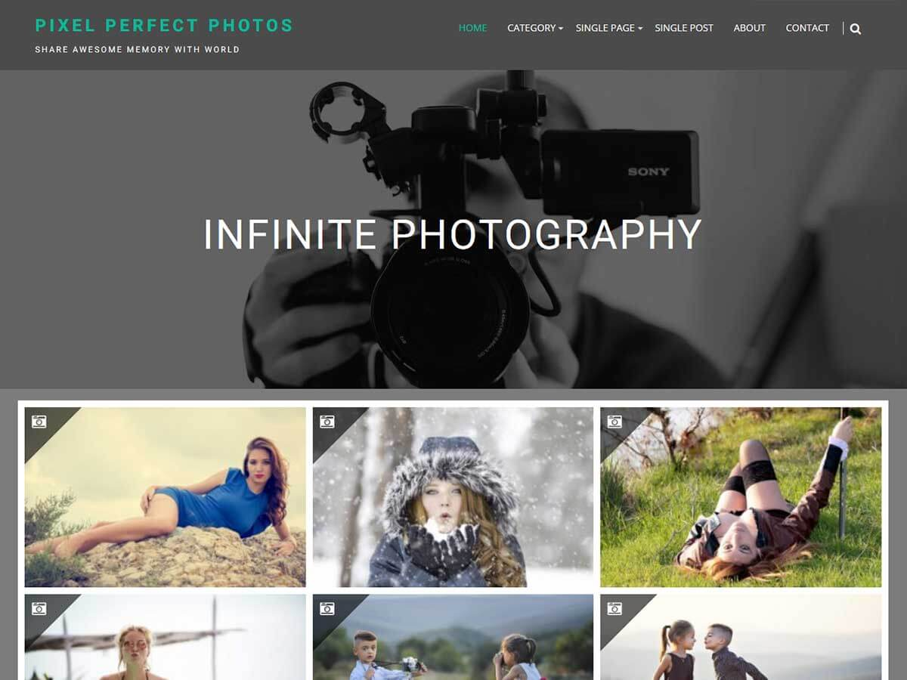

# Infinite Photography

**Contributors:** acmethemes  
**Requires at least:** 6.6  
**Tested up to:** 7.0  
**Requires PHP:** 7.4  
**Stable tag:** 4.0.0  
**License:** GPLv2 or later  
**License URI:** https://www.gnu.org/licenses/gpl-2.0.html  

> 

Infinite Photography is a clean, elegant theme designed for photo bloggers and visual storytellers. Whether you're into travel, food, lifestyle, or sports photography, its simple and uncluttered design lets your images do the talking. Full color control, flexible layout options, and seamless device support make it a joy to work with.

## Features

- **Grid layout** — clean image grids for galleries and portfolios
- **Up to four-column layouts** — flexible display for any content
- **Custom header & background** — personalize your visual identity
- **Custom logo support** — brand your photography site
- **Sidebar options** — left, right, or full-width layouts
- **Social icons** — connect Instagram, 500px, Flickr, and more
- **Custom copyright text** — add your own footer credit
- **Single-click color change** — update the entire site palette instantly
- **Related posts** — keep visitors browsing your work
- **Breadcrumb navigation** — clear structure for SEO
- **Translation ready** — .pot file included
- **RTL support** — right-to-left language compatible
- **Responsive** — looks stunning on every device

## Installation

1. Download the theme zip file.
2. In your WordPress admin, go to **Appearance → Themes**.
3. Click **Add New** → **Upload Theme**.
4. Select the zip file and click **Install Now**.
5. Click **Activate**.

## Frequently Asked Questions

### How do I customize the theme?

Go to **Appearance → Customize** — change colors, layout, header, and more in real time.

### What image sizes are recommended?

- Thumbnail: 500 × 280 (cropped)
- Medium: 690 × 400
- Large: 1080 × 530

## Credits

Infinite Photography is built on [Underscores](https://underscores.me/) and licensed under GPLv2 or later. It bundles the following third-party resources:

- [Google Fonts](https://fonts.google.com/) — Apache License 2.0
- [Font Awesome](https://fontawesome.com/) — MIT / SIL OFL 1.1
- [normalize.css](https://necolas.github.io/normalize.css/) — MIT
- [BxSlider](https://bxslider.com/) — MIT
- [Theia Sticky Sidebar](https://github.com/WeCodePixels/theia-sticky-sidebar) — MIT
- [Breadcrumb Trail](https://github.com/justintadlock/breadcrumb-trail) — GPLv2+
- [TGM Plugin Activation](http://tgmpluginactivation.com/) — GPLv2+
- [html5shiv](https://github.com/afarkas/html5shiv) — MIT
- [Respond.js](https://github.com/scottjehl/Respond) — MIT

---

[Demo](http://demo.acmethemes.com/infinite-photography/) &middot; [Support](https://www.acmethemes.com/supports/) &middot; [Acme Themes](https://www.acmethemes.com)
